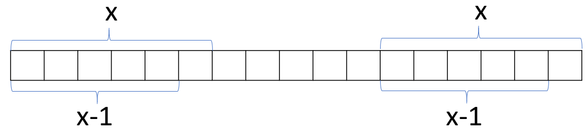
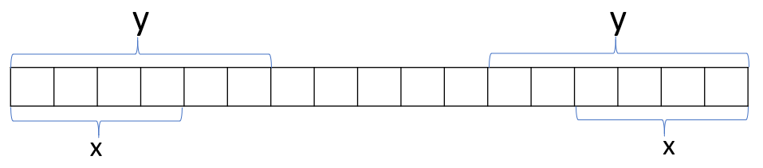
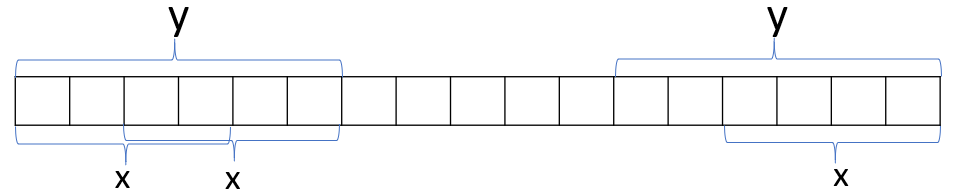

# KMP algorithm

## Problem

We have a string $word$ with index from $0$ to $len$, were $len$ is the length of the string $word$. Lets denotate $word_s$ as the prefix of $word$ until the index $s$; i.e. the substring from $0$ to $s$. And lets denote $X_s$ the set of all non proper substring such that each substring is a prefix and a suffix of $word_s$. We want to know $X_s$ for every $s$ from $0$ to $len$.

### Example

Lets supose that we have the string: *ABABABA*

Then $word_0 =$ *A*. Because is the prefix until $word[0] =$ *A* . So, $X_0 = \{ \}$, because the only substring that is a prefix and a suffix is *A*; but we ask for non proper substring and that is why *A* $\notin X_0$

$word_1 =$ *AB*, the first two letters of the string. Then, $X_1 = \{ \}$, because we have the prefix *A* but that is not a suffix of *AB*. Adn because we don't include proper substrings we have no more options, and $X_1$ is empty.

$word_2 =$ *ABA*. In here $X_2 = \{$ *A* $\}$. Because *A* is the prefix $word_0$ and the suffix from $word[2] =$ *A* to itself.

$word_3 =$ *ABAB*. Here, $X_3 = \{$ *AB* $\}$. Because *AB* is the prefix $word_1$ and the suffix from $word[2] =$ *A* to $word[3] =$ *B*. Lets note that *A*,*ABA* $\notin X_3$ because they aren't suffix.

$word_4 =$ *ABABA*, and $X_4 = \{$ *A*, *ABA* $\}$.

$word_5 =$ *ABABAB*, and $X_5 = \{$ *AB*, *ABAB* $\}$.

$word_6 =$ *ABABABA*, and $X_6 = \{$ *A*, *ABA*, *ABABA* $\}$.

## The algorithm

The problem solves using dynamic programing. Lets denote for the moment $DP[s] = X_s$. With that $DP[s]$ represents the set $X_s$. Let's note that $DP[0] = \{$ $\}$ because there are non proper prefix or suffix.

Note thst for every element $x \in X_s$ we have the following: 


We have that $x = word_j$ for some $j \in [0, s - 1]$. And lets denote $x-1 = word_{j-1}$, i.e. the string $x$ minus the last character. Because $x \in X_s$ it must happen that $x - 1 \in X_{s-1}$. It looks like:



In here we note that every element $x \in DP[s]$ we have that $x-1 \in DP[s-1]$. So one approach we could have until now for constructing $DP[s]$, it's to iterate over all the elements $x \in DP[s - 1]$ and check if the last caracter of $x + 1$ ($word[j+1]$) match with the caracter $word[s]$.

![Constructing DP[s] with DP[s-1]](IteratingOverDp.png)

Now lets change a bit how we store the $DP$ set, instead of keeping the hole substrings we can store the indexes of the strings. Because we can deduce the substrings by taking the prefix with that index ($word_s$). So $DP[i] = \{s \in [0, i] : word_s \in X_i\}$. In this case $DP[0] = \{-1\}$ because the index $-1$ represents the empty string.

Now let's take the $y_i$ as the maximun $s \in DP[i]$, i.e. $y_i = max(DP[i])$. We see, that $y_i <= y_{i-1} + 1$, i.e. the maximun substring that is a prefix and a suffix of $word_i$ could be the maximun of $word_i + 1$, the plus one is the caracter $word[i]$, that's because we see that each element in $DP[i]$ is an element in $DP[i-1]$ plus 1.

Lets see what happen for an element $x \in DP[i]$ so that $x < y_{i - 1} + 1$. So we have that:


But we have, that for $x - 1$, because the prefix is equal suffix with $y_{i-1}$. We have that, $x-1$ is a suffix of $word_{y_{i-1}}$ :


And then we know if the last caracter plus one are equal of any $x' \in X_{y_{i-1}}$ then $x'+1 \in X_i$


And then if $x \in X_i$ then $x-1 \in X_{i-1}$. So to find the max of $DP[i]$ we can check if $word[i] == word[y_{i-1} + 1]$ then the maximun is $y_{i-1} + 1$. If not, then the maximun must be in $DP[y_{i-1}]$ we can take the maximun of that ($y_{y_{i-1}}$) and do the same, if we can't find some value for $y_i$ it means that for that prefix there are not a substring that satiffies what we request ($X_i = \{$ $\}$). Another important thing to notice is that if $x \in X_i$ and $len(x) < y_i$ then $x \in X_{y_{i}}$ or in terms of $DP$, is that if $s \in DP[i]$ and $s < y_i$ then $s \in DP[y_i]$. Because we have:



Since the prefix $y$ equal to the suffix:



So it satisffacies what we said. So we can change $DP$ so it only stores the maximun index such that the substring it's a prefix and a suffix. And now $DP[i] = max( \{s \in [0, i] : word_s \in X_i\} )$. And if we want to know the other subtrings we can just go to $DP[DP[i]]$ and so on.

So we have the code for an string of size $n$: 

```c++
    dp[0] = -1;

    for (int i = 1; i < n; i++){
        int j = dp[i-1]; // We are going to check first if the maximun substring that is a preffix and a suffix is the maximun of i - 1 plus the new character we are adding
        while ( j >= 0 && word[j+1] != word[i]) // if j == -1 means that we coudn't find the substring, or if word[j+1] == word[i] means that the last character plus one of the maximun substring is equal to the last character of the preffix i, so this is the longest substring that is a prefix and a suffix of the i-th prefix. 
            j = dp[j]; //While niether of before happen, we move know to the preffix of the maximun substring, and repeat.
        if(word[j+1] == word[i]) j++; //If we find a match of the last letter that means that the prefix j match with the suffix - 1, and the last letter match so the maximun substring its j+1;
        dp[i] = j; //We store in DP the index of the maximun substring.
    }
```

We might thing this code could be $O(n^2)$, but in fact we can take out the line `int j = dp[i-1]` because in the last iteration we do $dp[i] = j$ and we are doing then $j = j$ which is redundant. So the code looks like:

```c++
    dp[0] = -1;
    int j = -1;

    for (int i = 1; i < n; i++){

        while ( j >= 0 && word[j+1] != word[i]) j = dp[j]; 
        
        if(word[j+1] == word[i]) j++;

        dp[i] = j; 
    }
```

The key part is to observe that in each iteration the variable $j$ must increase its value in $1$, it can decrease whaetever, but it can only decrease what it already increase. So our algorithm becomes $O(n)$

And we can just print for every prefix, each set of strings.

```c++
    for (int i = 0; i < n; i++){
        cout << "For the prefix from [0," << i <<"] which is "<< word.substr(0, i+1) << " the non-proper prefix that are also suffixes are:\n";
        j = dp[i]; // inticialize by the longest
        while( j != -1){
            cout << word.substr(0, j+1) << '\n';//We print the substring which must be a prefix.
            j = dp[j]; //We move to the longest substring of the prefix with size of my actual longest substring, that is my kth longest substring
        }
        cout << "\n";
    }
```