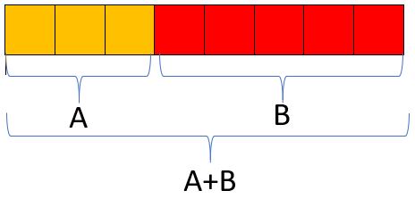
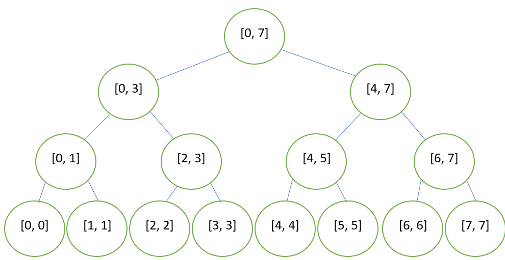
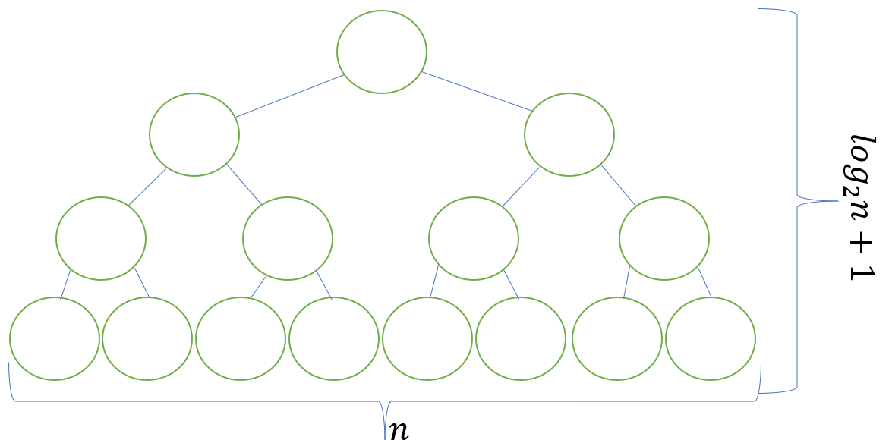
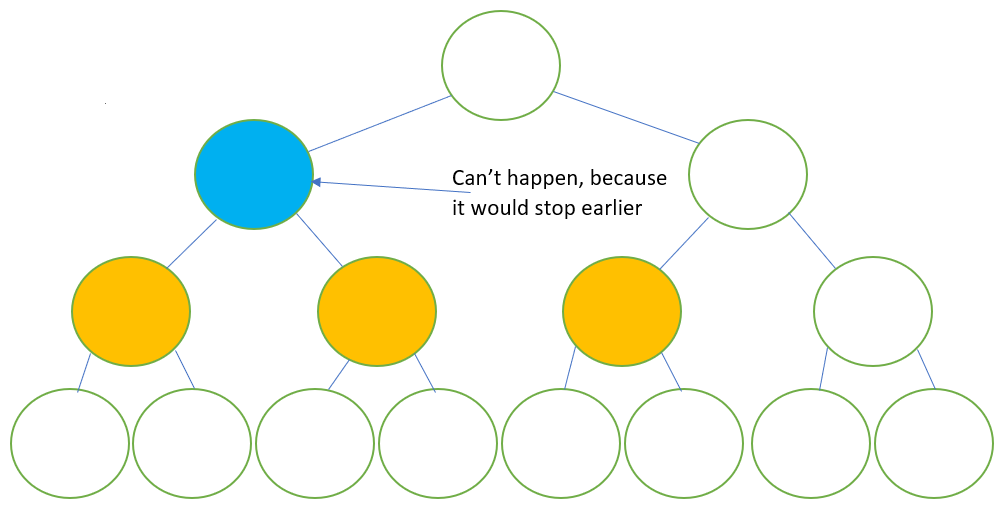

# Segment Tree

## Problem

You are given an array of $n$ elements. Then you are given $q$ operations, the operations are:

1. Give the sum of the elements in the array from $l$ to $r$ for a given $r,l \in [0, n]$ and $l \leq r$ 
2. Change the element in the position $pos$ to a value $k$.

*Consider the first position of the array $0$.

### Example

Consider the array:

| 10 | 5 | 9 | 7 | 2 | 34 |
|----|---|---|---|---|----|

Then you are given $3$ operations:

1. $(1, 2, 5)$

   Since the first numer is a $1$ we must give the sum from position $2$ until $5$. Which is $9 +7 + 2 + 34 = 52$

2. $(2, 3, 10)$

    Since the first number is a $2$ the operation is to change the number in position $3$ in to a $10$. So the array now looks like:

    | 10 | 5 | 9 | 10 | 2 | 34 |
    |----|---|---|----|---|----|

3. $(1, 1, 4)$

    We must give the sum from position $1$ to $4$ which is $5 + 9 + 10 + 2 = 26$

## The algorithm

For solving this problem it exist a data structure called "Segmente tree". The idea of the segment tree is a binary tree in which the root of the tree have the solution of the problem for all the range (in this case the sum of all the array). Then there children have the solution of the problem for a subrange, were the range of the two children are disjoined and the union of their range is the total range. 

In order to do a segment tree the problem should be able to construct by the solution of the problem in $2$ subranges. For example, in the sum is we want to know the sum of a range we can go recurive and get the sum of a subrange, and then the sum for the other and we sum both results to have want we want



And in general for every node that's not a leaf it must have that the two children are a solution for a subrange of the node so that the two range are disjoined but the union of the two give the total, range. And the leaf are the nodes with range $[a, a]$ for $a \in [0, n-1]$

Every node that is not a leaf has a range $[a, b]$ with $a < b$ for convetion we take the range of the left child as $[a, c]$ for some $c \in [a, b)$ and the right child should have the range $(c, b]$. We notice that if we take $c$ to much to the right the tree will grown very large on the right size and the same for the left size. So the optimal solution is to take $c$ in the middle of the range, i.e $c = \frac{a+b}{2}$ and then the left child is $[a, \frac{a+b}{2}]$ and the right one is $[\frac{a+b}{2}+1, b]$. So for an array of $8$ elements, the tree looks like:



¿How do we construct this tree if we want to make it for sums? Like we said this is just recursive, just let the leaf take the value of the position in the array (the leaf with range $[i,i]$ will have the value $array[i]$). Let's make the struct for the node of the segment tree.

```c++
struct nodo{
    int val; //The value of the node
    int a, b; //The range
    nodo *l, *r; //Pointer to their child
} *head; //Head is the pointer to the root
```

And the function to construct it we need to construct the root, but because it's recursive by contructing the root we can construct all the segment tree.

```c++
int construct(nodo *node, int *ar){ //Tipe int because it will be returning values of the nodes to construct the other nodes, and ar is the array were the values are store.
    if (node -> a == node -> b){ //It's a leaf
        node -> val = ar[node -> a];
        return node -> val;
    } //Then its not a leaf so:
    //Create left child
    node -> l = new nodo;
    (node-> l) -> a = node -> a;
    (node -> l) -> b = (node -> a + node -> b) /2;
    //Create left child
    node -> r = new nodo;
    (node-> r) -> a = (node -> a + node -> b) / 2 + 1;
    (node -> r) -> b =  node -> b;
    //Get the value with recursion
    node -> val = construct(node -> l, ar) + (node -> r, ar); 
    return node -> val;
}
...
//Initialize the range of the root
head -> a = 0;
head -> b = n; 
//Construct the ST
construct(head, ar);
```

This code is a bit large and can be confusing for some people. And we are using memory that we can save, if we see we don't really need to store in each node the range, we can just seat it as a parameter on the funtion. And we can create a macro that gives us the middle between $a$ and $b$ just for a cleaner code. So we can do:

```c++
#define mid (a, b) ((a+b)/2)
...
struct nodo{
    int val;//The value of the node
    nodo *l, *r; //Pointer to their children
} *head; //Head is the pointer to the root

int build(int l, int r, nodo* node, int* ar){ /*Tipe int because it will be returning values of the nodes to construct the other nodes, and ar is the array were the values are store. l and r are the range of the current node*/
    if (l == r) node -> val = ar[l]; //If it's a leaf
    else{
        node -> l = new nodo; //Create left child
        node -> r = new nodo; //Create right child
        node -> val = build(l, mit(l, r), node -> l, ar) + build(mit(l, r) + 1, r, node -> r, ar); //Get the value with recursion 
    }
    return node -> val; //Return the value of node, so the other nodes can use it to construct  
}
```

¿To much memory?¿To slow? Lets first answer the memory cuestion. We know that there are $n$ leafs because each leaf can only be an element of the original array. So the lowest level of the tree have at must $n$ nodes, because this a binary tree we know that the level before that have at must $n/2$ nodes, because for each pair of node they have one father, and so on. So for each level there are al must $n / 2^{i}$ nodes were $i$ is the number of levels from the lowest to the actual. We know that in the first level there is only one node. So in the first level $i = \log_2{n}$ because:

$$ \frac{n}{2^{\log_2(n)}} = \frac{n}{n} = 1 $$

So the distance between the lowest node and the root (the height of the tree) is $\log_2 n + 1$ the plus one is because with $i$ with count the last level as $0$.



And since it's a binary tree the maximun numer of node that it could have are:$2^{k}$ were $k$ is the height. Then the segment three have al must:

$$2^{\log_2n + 1} = 2 * n$$

So the memory it's just 2 times the size of the original array. And the creation only pases one time over each node so construction takes $O(N)$.

Now for answer a question type 1 we must see that each node hace 3 possible states for the question:

1. The range of the node is completly out of the range of the question.
2. The range of the node is completly inside of the range of the question. 
3. The range of the node have some elements that are part of the question.

Then we can go from the top of the tree, and ask if 1 happens then we return 0 because all that segment is useless for the question. If 2 happens we can just return the value of the node (there is no case to go under that node because that node contains the answer of all the subtree). If 3 happens we can just ask the same question for the children to "see" whats useful information they have and we just add it up. So the query function is like

```c++
int query(int lq, int rq, int l, int r, nodo* node){ //lq and rq are the range of the question
    if (r < lq || rq < l) return 0; //Completly outof range
    if (lq <= l && r <= rq) return node -> val; //Completly in range
    return query(lq, rq, l, mit(l, r), node -> l) + query( lq, rq, mit(l, r) + 1, r, node -> r); //With some useful elements
}
```

And to see the complexity we need to notice that for each level of the tree the answer use at most 2 nodes. Supose that it uses 3 nodes *a*, *b*, *c*, we can supose that $a < b < c$ without lost of genarility. since the query is a contigous range it means that the range from the node *a* to *b* it's and answer and so *b* and *c*, and that means that there another node in the level before that it's an answer, so the function will never go $b$ because it stop in a level before.



And because the tree have $\log_2n + 1$ height. The complexity becomes $O(\log n)$.

And finally for the position we can just search in the tree the leaf $[pos, pos]$. And because in the tree all range are disjoin, it only exist one node that contains the node being updated. So we just need to go to 1 node for level that's $O(\log n)$. And we do this recursive in order to update all the nodes that we pass in (the ones that contains $pos$ in the range). And we got:

```c++
int update(int l, int r, int pos, nodo* node, int k){ //Pos is the position of the update and k the new value of the number in pos
    if (r < pos || pos < l) return node -> val; //If this node doesn't contain the update just return the value without change
    if (pos <= l && r <= pos) node -> val = k; //If we are in the leaf number to be uptade we change the value
    else node -> val = update(l, mit(l, r), pos, node -> l, k) + update(mit(l, r)+1, r, pos, node -> r, k) ; /*It's a node thats contains
    the node being updated so it must update its value to whatever their children returns*/
    return node -> val; //return the value for recursive update
}
```

And then we just add a function that deletes the dynamic memory we creat when we finish

```c++
void erase(nodo *node){
    if (node -> l == NULL){ //Its a leaf because it hasn't children
        delete node;
        return;
    } //If not, is a node with child and we need to erase it children recursive
    erase(node -> l);
    erase(node -> r);
    //We already delete all the node down this one
    node -> l = NULL; //Set pointers to children NULL
    node -> r = NULL;
    delete node; //Delete the actual node
}
```

So the segment tree solves the problem in $O(K\log N)$