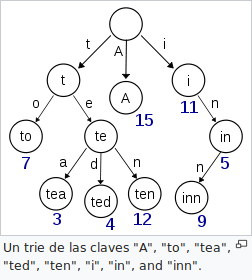

# TRIE

TRIE es una **estructura de datos** de tipo **árbol** que permite la recuperación de información (de ahí su nombre del inglés re**TRIE**val). La información almacenada en un TRIE es un conjunto de claves, donde una clave es una secuencia de símbolos pertenecientes a un alfabeto. Las claves son almacenadas en las hojas del árbol y los nodos internos son pasarelas para guiar la búsqueda. El árbol se estructura de forma que cada letra de la clave se sitúa en un nodo de forma que los hijos de un nodo representan las distintas posibilidades de símbolos diferentes que pueden continuar al símbolo representado por el nodo padre. Por tanto la búsqueda en un TRIE se hace de forma similar a como se hacen las búsquedas en un diccionario.

## Explicación
El árbol del TRIE consiste en múltiples ramas. Cada rama representa un posible carácter de una clave. Necesitamos marcar el nodo correspondiente al último carácter de cada clave. Cada nodo se genera de forma dinámica en cuanto a memoria.
